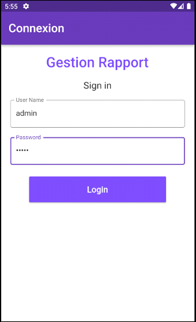
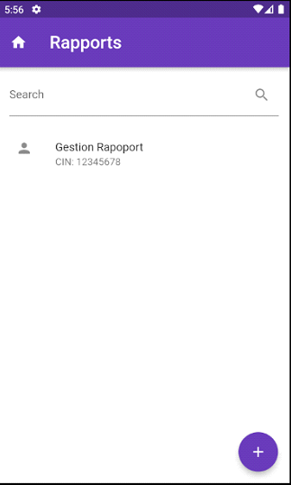
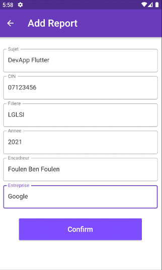
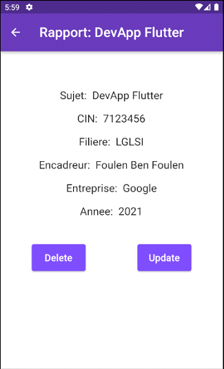
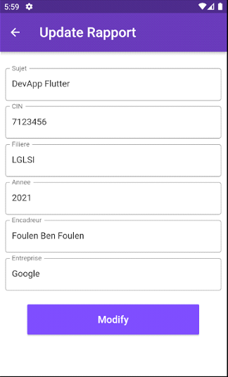

# Project Management Application

A small attempt to make a project management app user interface in Flutter for Android and iOS.

## App Preview

&nbsp;&nbsp;&nbsp;&nbsp; &nbsp;&nbsp;&nbsp;&nbsp;&nbsp;&nbsp;&nbsp;&nbsp;&nbsp;&nbsp;&nbsp;&nbsp;
